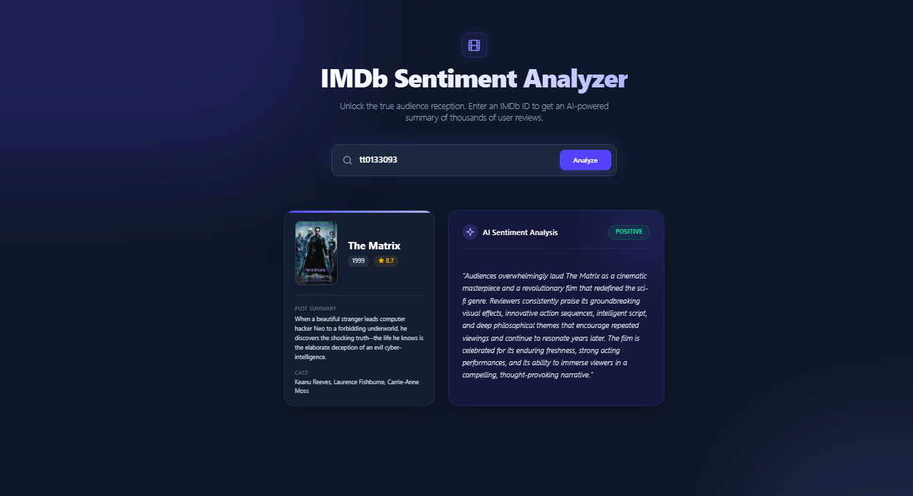

# 🎬 IMDb Sentiment Analyzer


A sleek, modern web application that utilizes Google's Gemini AI to analyze the true audience sentiment of any IMDb movie. Enter a movie ID, and the app instantly scrapes metadata, aggregates user reviews, and generates an insightful AI-powered sentiment classification.

## 📸 Screenshot



### ✨ Features

- **🧠 AI Sentiment Analysis:** Leverages Google's `gemini-2.5-flash` model to summarize thousands of review words into a concise 2-3 sentence insight.
- **📊 Real-time Data Scraping:** Uses `cheerio` to extract rich movie metadata (posters, cast, rating, plot) and user reviews directly from IMDb using JSON-LD and robust CSS fallbacks.
- **⚡ In-Memory Caching:** Prevents redundant API calls and scraping by caching previous search results, making repeated searches instantaneous.
- **🎨 Premium UI/UX:** Built with Tailwind CSS and Framer Motion for a beautiful glassmorphism design, smooth state transitions, and interactive elements.
- **🛡️ Type-Safe & Error Proof:** Developed with strict TypeScript interfaces and comprehensive error handling for invalid IDs and missing data.
- **🛠️ Mock Mode:** Automatically falls back to a mocked AI response for UI testing if the Gemini API key is not provided.

### 💻 Tech Stack

- **Frontend:** Next.js (App Router), React 19, TypeScript
- **Styling & Animations:** Tailwind CSS v4, Framer Motion, Lucide React (Icons)
- **Backend (API Route):** Node.js
- **Scraping:** Cheerio
- **AI Integration:** `@google/genai` (Gemini API)

### 🚀 Getting Started

Follow these instructions to set up the project locally on your machine.

### Prerequisites
- Node.js (v18 or higher recommended)
- npm, yarn, or pnpm
- A Google Gemini API Key (Get one from [Google AI Studio](https://aistudio.google.com/))

### Installation

1. **Clone the repository**
   ```bash
   git clone https://github.com/dhruvmohan867/STIRR.git
   
### 2. Navigate into the project directory
```
cd STIRR

```
### 3. Install dependencies
```
npm install
```
### 4. Start the development server
```
npm run dev
```

---
### Once the server is running, open http://localhost:3000 in your browser. Enter an IMDb ID (e.g., tt0133093 for The Matrix) to test the application!
---

## 📁 Project Structure

```

├── app/
│   ├── api/analyze/route.ts   # Next.js API route handling caching, scraping, and AI logic
│   ├── globals.css            # Tailwind theme configurations and custom glassmorphism styles
│   ├── layout.tsx             # Root layout with global background glows and fonts
│   └── page.tsx               # Main frontend UI with Framer Motion animations
├── lib/
│   ├── gemini.ts              # Gemini API integration and prompt engineering
│   └── imdb.ts                # Cheerio scraping logic for metadata and user reviews
├── public/                    # Static assets
├── package.json               # Project dependencies
└── tsconfig.json              # TypeScript configuration

```
### 🤝 Contributing
 
 ```
 Contributions, issues, and feature requests are welcome! Feel free to check out the issues page.

Fork the Project

Create your Feature Branch (git checkout -b feature/AmazingFeature)

Commit your Changes (git commit -m 'Add some AmazingFeature')

Push to the Branch (git push origin feature/AmazingFeature)

Open a Pull Request
```